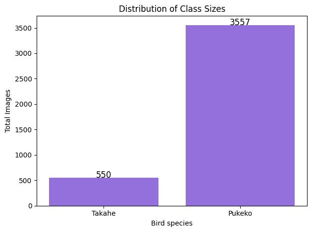
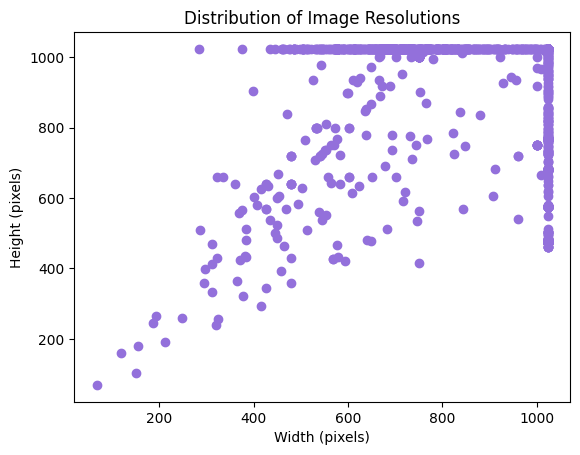
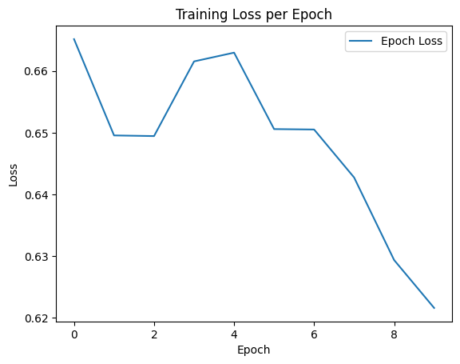
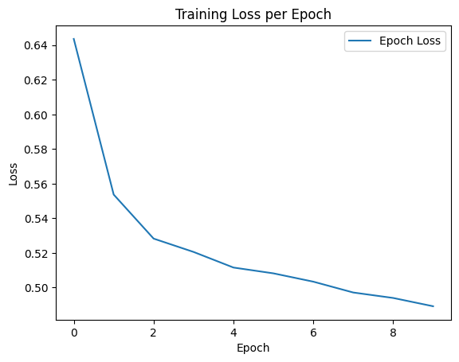

# Takahe_detection

# Purpose

My aim for this project was to make a machine learning model that could distinguish between takahe and pukeko images, and could do this with better accuracy than random guessing.

# Data cleaning
The data was obtained from GBIF-NZ, it includes records from 6 datasets: iNaturalist Research-grade Observations Observation.org, Nature data from around the World, Auckland Museum Land Vertebrates Collection, Xeno-canto - Bird sounds from around the world, NABU|naturgucker, MVZ Egg and Nest Collection (Arctos)

There were 4258 occurances in the original dataset, but this was reduced to 4202 occurances as a result of data cleaning. The images removed during data cleaning process were pictures of bird eggs.

Of the original 4258 occurances, 581 were takahe (Porphyrio hochstetteri) and 3621 were pukeko (Porphyrio melanotus subsp. melanotus).

In the cleaned dataset 550 were takahe (Porphyrio hochstetteri) and 3557 were pukeko (Porphyrio melanotus subsp. melanotus).

The data set has imbalanced classes, to improve the accuracy of the models class weights have been used in the loss functions of each model.

The data cleaning and downloading of the images was performed in Rstudio. The data modelling, analysis, and visualisation was performed using Python version 3.12.9

## EDA
The exploratory data analysis showed some significant class imbalance:

This was handled by adding class weights to the loss function.

The images resolutions varied:

To resolve this when loading the images in to work with Pytorch the images are resized depending on the model.

## Modelling
I made three models and stacked them to get my final model. The meta-model trained on the outputs of modelA, modelB and modelC was a Logistic Regression model.

The first two models, Model A and Model B, were convolutional neural networks (CNNS) with different class weights for the loss function. The third model, Model C, was a EfficientNet-B3 model.

They were all trained with 10 epoches and different class weights.

I looked at the training loss per epoch for each of the models:

Model A training per epoch:

For Model A I can see that the training loss per epoch starts increasing at 2 epoches and starts decreasing after epoch 4, this could be due to the optimiser as Adam's moment estimates adapt over  or due to the random composition of the batches (those epochs could have had difficult or mminority-class heavy batches).

I think this is unlikely to be due to the scheduler StepLR as the learning rate only decreases over the epochs.

After epoch 4 the training loss does decrease indicating that the model is learning and minimizing the error on the training set.

Model B training per epoch:

For Model B I can see that the training loss per epoch is consistently decreasing which indicates that the model is learning and minimizing the error on the training set.

It's best to note that since I am using class weights for model A, B and C then my training loss values are skewed (some samples contribute more to the loss). And on an imbalanced dataset, even small loss reductions could reflect big accuracy jumps.

## Model evaluation
I evaluated the performance of these models individually using accuracy. This was done both overall for each model and per class, where Pukeko images are class 0 and Takahe images are class 1.

|                  | Model A        | Model B  | Model C | Meta-model|
|------------------|----------------|----------|---------|-----------|
| Overall Accuracy | 81 %           | 85 %     | 86 %    | 88%       |
| Class 0 Accuracy | 90.1 %         | 97.8 %   | 88.8 %  | 88.76%    |
| Class 1 Accuracy | 25.3 %         | 3.8 %    | 72.2 %  | 84.78%    |

The meta-model was better at classifying takahe (class 1) images than any of the three models, but worse at classifying pukeko (class 0) images than all three.

Given the class imbalance, where takahe images made up only 13% of the data set, the small loss in accuracy for class 0 (pukeko) for the significant increase in class 1 (takahe) accuracy is a decent trade off.

The meta model performed significantly better than random guessing at classifying the pukeko and takahe images.

## Citations
GBIF.org (15 June 2025) GBIF Occurrence Download  https://doi.org/10.15468/dl.mhxdcy
