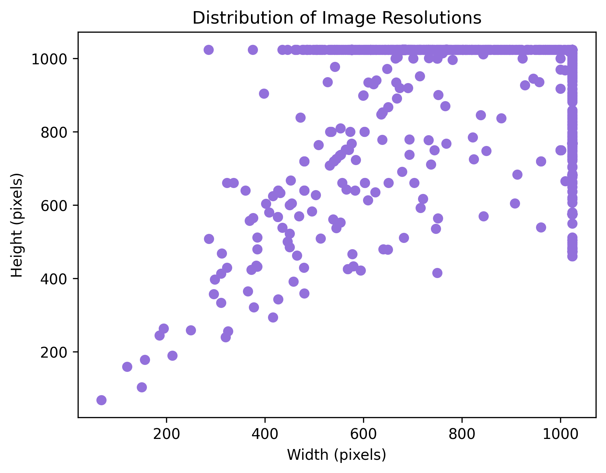

# Takahe_detection
# Citations
GBIF.org (15 June 2025) GBIF Occurrence Download  https://doi.org/10.15468/dl.mhxdcy

Data was obtained from GBIF-NZ, it includes records from 6 datasets: iNaturalist Research-grade Observations Observation.org, Nature data from around the World, Auckland Museum Land Vertebrates Collection, Xeno-canto - Bird sounds from around the world, NABU|naturgucker, MVZ Egg and Nest Collection (Arctos)

There were 4258 occurances in the original dataset, but this was reduced to 4202 occurances as a result of data cleaning.
Of the original 4258 occurances, 581 were takahe (Porphyrio hochstetteri) and 3621 were pukeko (Porphyrio melanotus subsp. melanotus).
In the cleaned dataset 550 were takahe (Porphyrio hochstetteri) and 3557 were pukeko (Porphyrio melanotus subsp. melanotus).
The data set has imbalanced classes to imrpove the accuracy of the model class weights have been used in the loss function.

The data cleaning and downloading of the images was performed in Rstudio.

This was made using Python 3.12.9

The exploratory data analysis showed some significant class imbalance:

This was handled by adding class weights to the loss function.

The images had different resolutions:

To resolve this when loading the images in to work with Pytorch the images are resized to 600 by 600

